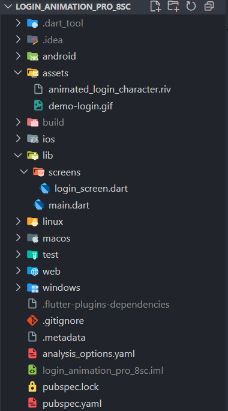
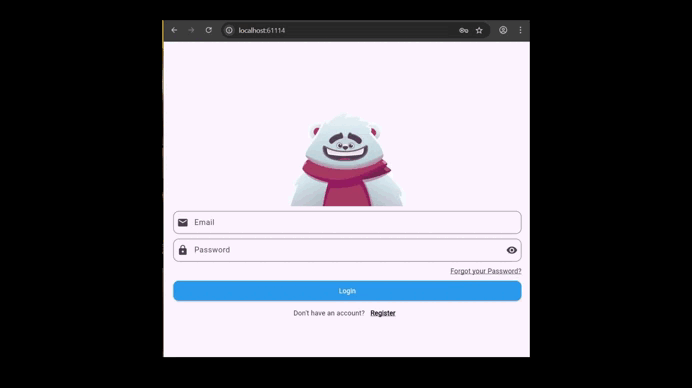

## 🔐 Login Animation Pro  

Welcome to **Login Animation Pro**, an application developed in **Flutter** using **Dart**, designed to provide an **interactive login screen** with dynamic animations that respond to user interactions.  

## 📚 Course Info

- Course Name: Mobile Application Programming

-CREATED BY : JAIR DAVID CANUL SERRALTA

- Instructor: Rodrigo Fidel Gaxiola Sosa

## 🖼 About Rive & State Machine  
- [Rive](https://rive.app/) is a powerful tool for **creating interactive animations** that can be integrated into apps.  
- **State Machines** in Rive allow animations to **react dynamically** to events and user input, like the bear responding to email/password input in this app.  

## ✨ Main Features  
- Login form with **predefined validation**.  
- **Show or hide password** using a button in the corresponding field.  
- **Interactive bear animation** (Rive `.riv` file) that:  
  - Covers its eyes when typing the password.  
  - Looks at the text while typing the email.  
  - Celebrates when entering correct credentials (`trigSuccess`).  
  - Gets sad when entering incorrect credentials (`trigFail`).  
- Minimalist and responsive design for different devices.  

## 📂 Main Files  
- `lib/main.dart` → Entry point of the app.  
- `lib/screens/login_screen.dart` → Login screen with animation and interaction.  
- `assets/animated_login_character.riv` → Rive bear animation file.  
- `pubspec.yaml` → Dependencies and asset configuration.  

## ⚙️ Technologies and Tools  
- [Flutter](https://flutter.dev/)  
- [Dart](https://dart.dev/)  
- [Rive](https://rive.app/) → [Interactive bear animation](https://rive.app/marketplace/3645-7621-remix-of-login-machine/)  
- [Visual Studio Code](https://code.visualstudio.com/)  

## 🚀 How to Run the Project  
1. Clone this repository:  
   
   git clone https://github.com/Jair-Canul/login_animation_pro_8sc.git
2. Navigate to the project folder:

- cd login_animation_pro_8sc

3. Install dependencies:

- flutter pub get

4. Run the application:

- flutter run

## 📝 Code Details

- The email TextField activates the eye animation to follow the typed text.

- The password TextField activates the hands covering the eyes animation.

- The Login button triggers:

- trigSuccess → if the email and password are correct (jdcs2303201@gmail.com / Jair123).

- trigFail → if either the email or password is incorrect.

- debounce timer is used to detect when the user stops typing and update the animation.

## 🎬 Demo Aplication

## 🎨 Credits

- Bear animation created by Rive Marketplace Creator [dart](https://rive.app/marketplace/3645-7621-remix-of-login-machine/)
